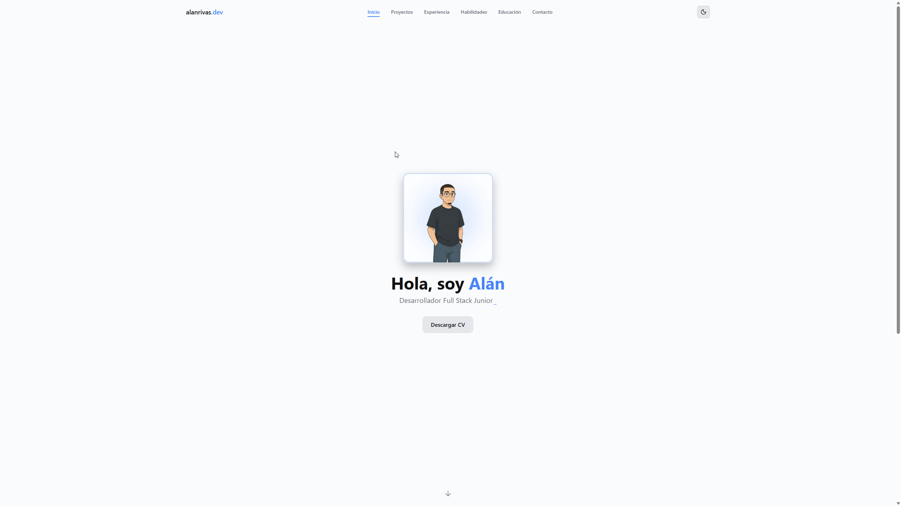
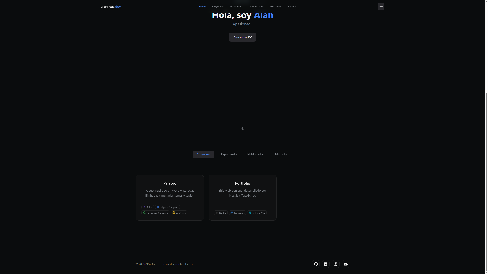
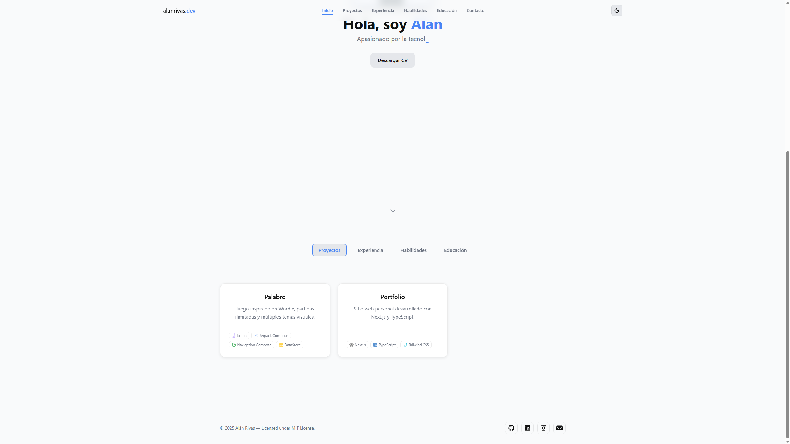
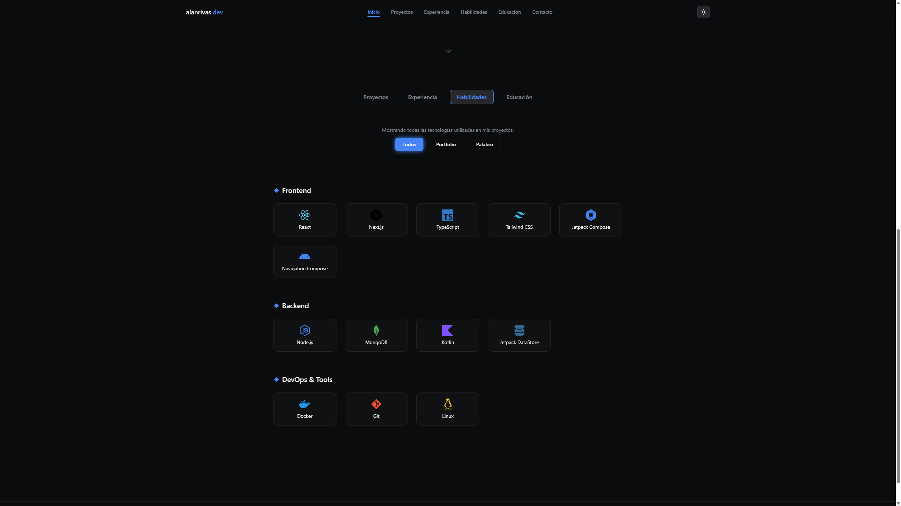
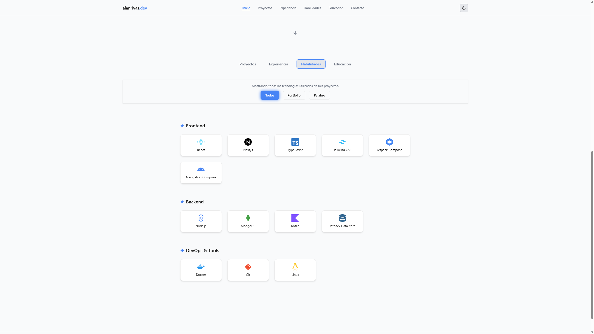
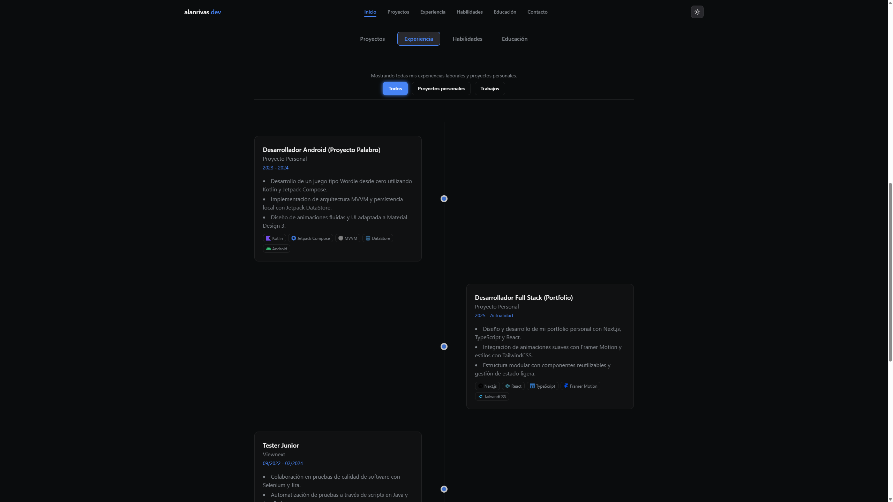
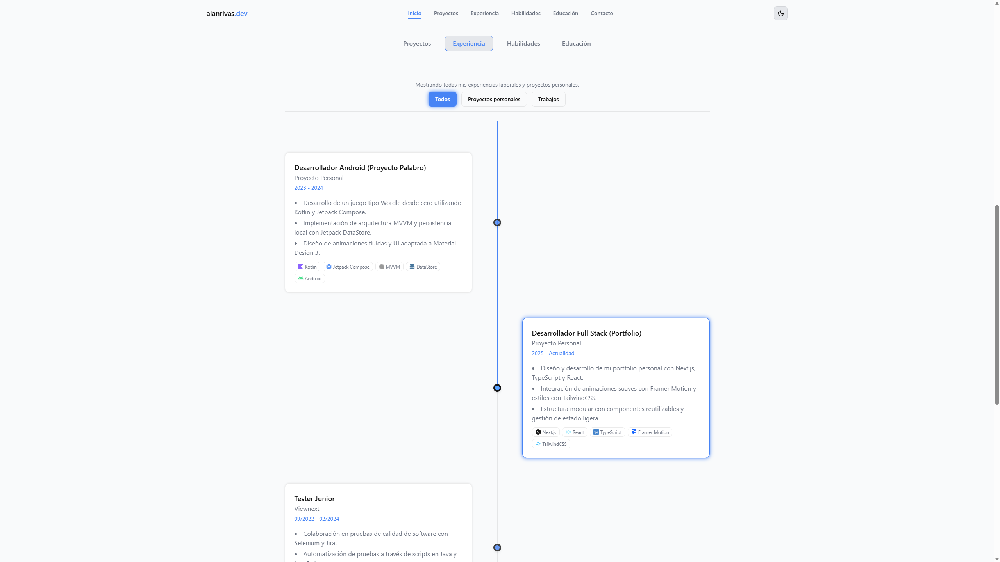
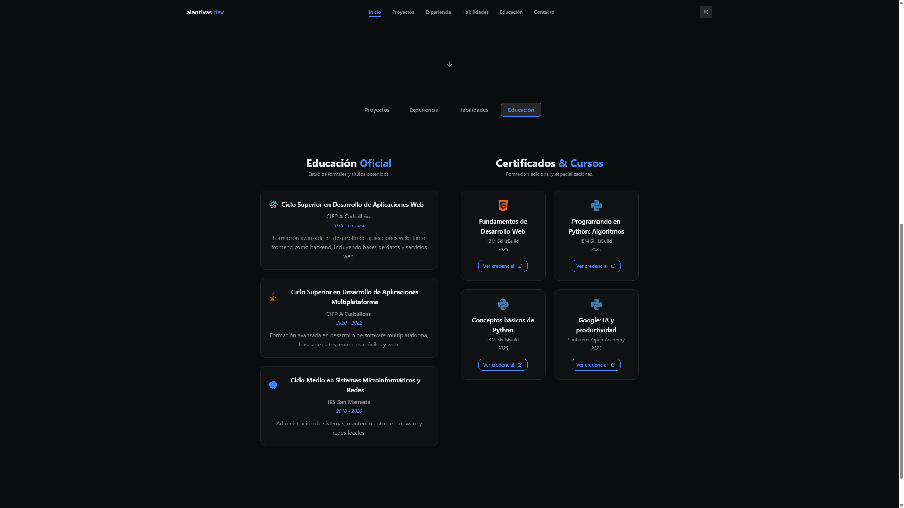
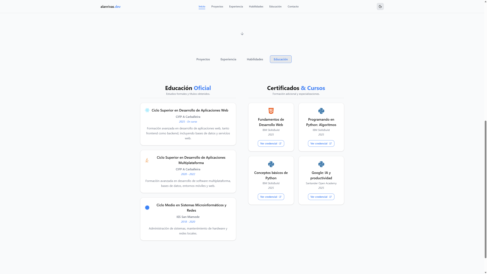

# 🧑‍💻 Portfolio Personal — Alán Rivas

Portfolio profesional desarrollado con **Next.js**, **React**, **Tailwind CSS** y **Framer Motion**.  
Incluye animaciones fluidas, diseño responsive, un ProjectModal avanzado con carrousel de imágenes/GIFs, filtros dinámicos en Skills, visualización de certificados en PDF y secciones completamente personalizadas.

🌐 **Live demo:** https://alanrivas.com

---

## 🚀 Tecnologías principales

- **Next.js 14 (App Router)**
- **React 18**
- **TypeScript**
- **Tailwind CSS**
- **Framer Motion**
- **Heroicons**
- **Vercel** (deploy)

---

## ✨ Funcionalidades

### 🎨 Diseño moderno y responsive
- UI inspirada en portfolios profesionales  
- Totalmente responsive (mobile → desktop)

### 🎬 Animaciones avanzadas con Framer Motion
- Fade-in / slide-in  
- Animaciones en scroll  
- Microinteracciones en componentes  

### 🖼️ ProjectModal con carrousel
- Imágenes + **GIFs compatibles**  
- Navegación con flechas  
- Fullscreen viewer  
- Animaciones al abrir/cerrar  

### 🧠 SkillsTab dinámico
- Filtros por categoría  
- Skills provenientes de **proyectos + experiencia propia**  
- Animaciones al cambiar de tab  

### 💼 ExperienceTab
- Tarjetas limpias con animación  
- Sección clara y de lectura rápida  

### 🎓 EducationTab
- Doble columna (Educación oficial + Certificados)  
- Títulos sticky  
- Visualización de certificados en PDF dentro del portfolio  

### 📩 ContactModal funcional
- Formulario animado  
- Validación  
- Cierre con animación  
- Preparado para integración con backend (Node / API propia)

---

## 📸 Capturas

### 🏠 Home
#### 🌙 Modo oscuro

#### ☀️ Modo claro

---

### 📂 Projects
#### 🌙 Modo oscuro

#### ☀️ Modo claro

---

### 🧠 Skills
#### 🌙 Modo oscuro

#### ☀️ Modo claro

---

### 💼 Experience
#### 🌙 Modo oscuro

#### ☀️ Modo claro

---

### 🎓 Education
#### 🌙 Modo oscuro

#### ☀️ Modo claro

