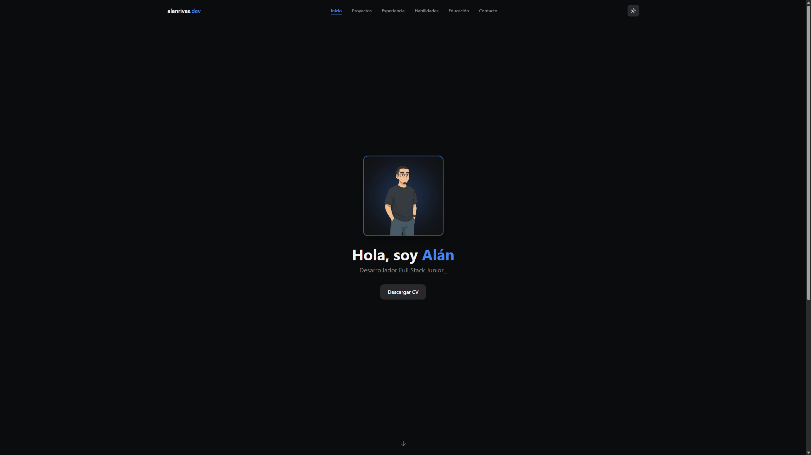

# 🌐 Portfolio — Alán Rivas

**Portfolio personal desarrollado con [Next.js](https://nextjs.org/) y [TypeScript](https://www.typescriptlang.org/)**.  
Un sitio web moderno, minimalista y totalmente responsive para mostrar mis proyectos, experiencia y formación como desarrollador Full Stack.



---

## 🚀 Tecnologías Principales

| Categoría | Tecnologías |
|------------|-------------|
| **Frontend** | Next.js · React · TypeScript · Tailwind CSS · Framer Motion |
| **Backend (API Routes)** | Node.js · Nodemailer · MongoDB (Atlas) |
| **DevOps** | Vercel (Hosting + CI/CD) |
| **Otros** | Email API · Animaciones · PDF Viewer · Responsive Design |

---

## 🧩 Estructura del Proyecto

```bash
portfolio/
│
├── frontend/                # Aplicación principal (Next.js)
│   ├── public/              # Recursos estáticos (imágenes, PDFs, íconos)
│   ├── src/
│   │   ├── app/             # Rutas y páginas
│   │   ├── components/      # Componentes reutilizables
│   │   ├── data/            # Datos estáticos (proyectos, skills, educación…)
│   │   ├── hooks/           # Custom hooks
│   │   ├── lib/             # Lógica de backend (API, DB, email…)
│   │   └── utils/           # Utilidades (iconMap, helpers…)
│   ├── .env.local           # Variables de entorno (solo local)
│   ├── next.config.ts       # Configuración de Next.js
│   ├── tailwind.config.ts   # Configuración de Tailwind
│   └── package.json
├── .gitignore
└── README.md
